# Workflow
{: .no_toc }

## Table of contents
{: .no_toc .text-delta }

1. TOC
{:toc}

## Introduction
This page is for those who have no idea of the steps involved in making a 3D VTuber model, or who would like to learn more about certain steps.

```mermaid
flowchart TD;
	subgraph Blender
		subgraph Modelling
			m1(Body modelling)-->m4(Outfit modelling)
			m2(Head modelling)-->m3(Hair modelling)
		end
		subgraph Texturing
			t1(Body texturing)-->t4(Outfit texturing)
			t2(Head texturing)-->t3(Hair texturing)
		end
		subgraph UVs
			u1(UV unwrapping)-->u2(UV editing)
		end
		r-->wp(Weight Painting)
		Modelling-->r(Rigging)
		wp-->s(Shapekeys)
		s-->e(Expressions)
		UVs-->Texturing
		Modelling-->UVs
		e-->re(Rendering)
		e-->ex(FBX Export)
		Texturing-->ex
	end
	subgraph Unity
		i(FBX Import)-->vrm(VRM)
		vrm-->bl(Blendshapes)
		vrm-->phy(Physics)
		vrm-->mat(Materials)
		vrm-->an(Animations)
		vrm-->tog(Toggles)
		bl-->vsf(VSF export)
		phy-->vsf
		mat-->vsf
		tog-->vsf
		an-->vsf
	end
	ex-->Unity
	classDef MGroup fill:#7248a8
	class Modelling MGroup
	classDef UGroup fill:#6a76de
	class UVs UGroup
	classDef TGroup fill:#368eba
	class Texturing TGroup
	classDef BGroup fill:#402e63
	class Blender BGroup
	classDef UnityGroup fill:#582c63
	class Unity UnityGroup
```

